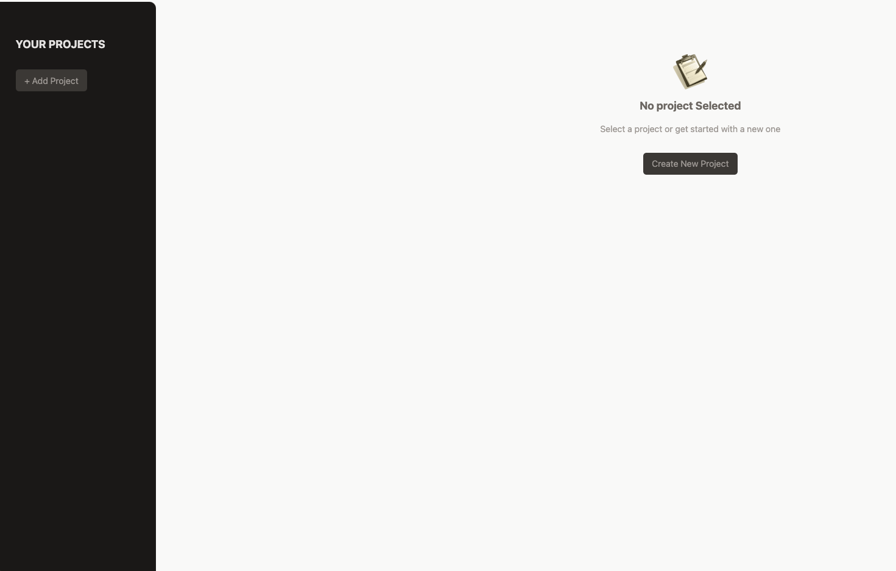
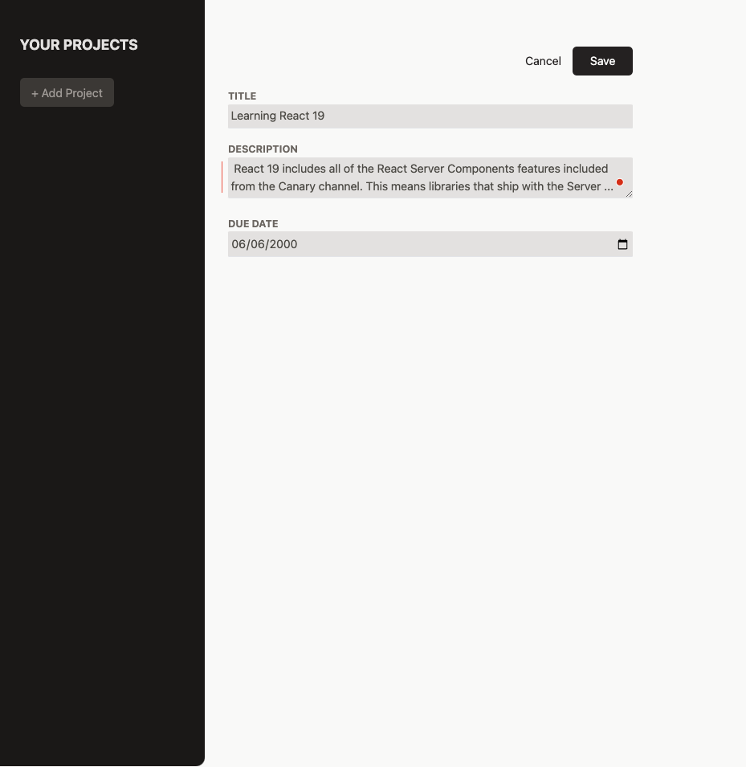
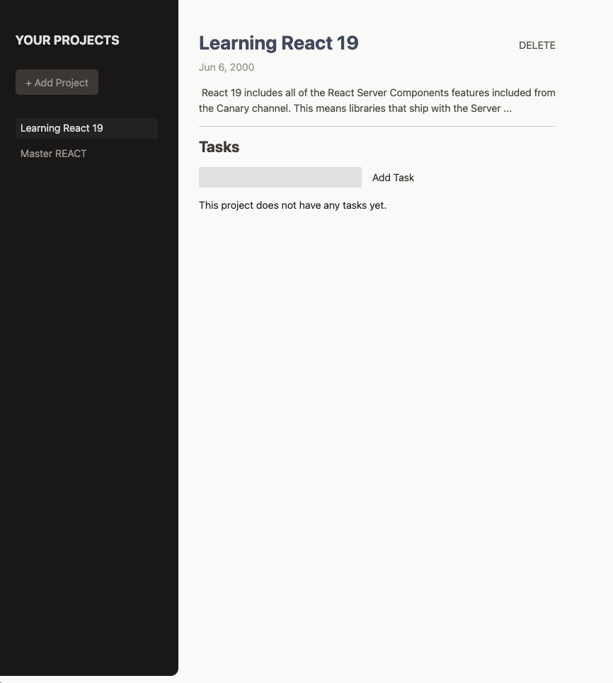
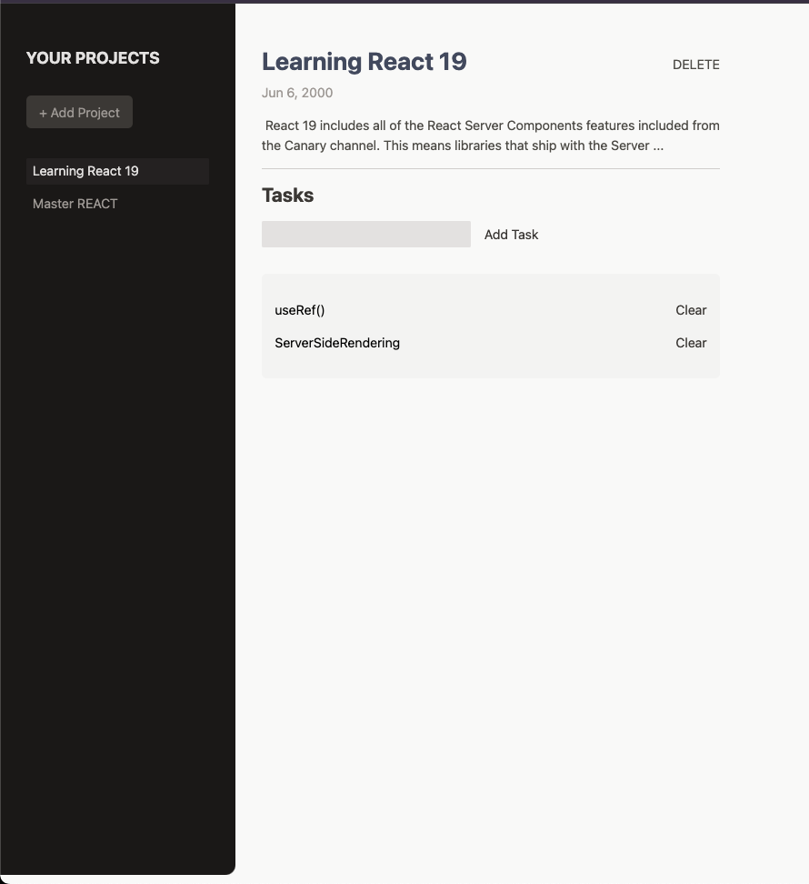

# Project Management App

A modern React-based project management application that allows users to create, manage, and track projects and their associated tasks.

## Features

- 📋 Create and manage multiple projects
- ✅ Add tasks to each project
- 🗑️ Delete projects and tasks
- 📅 Set due dates for projects
- 💫 Smooth animations and transitions
- 🎨 Modern and clean UI design
- 📱 Responsive layout

## Screenshots

<div style="display: flex; gap: 20px; margin-bottom: 20px;">
    
    
</div>

<div style="display: flex; gap: 20px;">
    
    
</div>

## Technologies Used

- React.js
- Tailwind CSS
- React Portals
- Modern JavaScript (ES6+)

## Getting Started

1. Clone the repository
``` https://github.com/Resan-ramazan/ProjectManagmentApp```
2. Install Dependencies
```
cd project-management-app
npm install
```
3. Start Development server
   ``` npm run dev ```

## Features in Detail

- **Project Management:**
  - Create new projects with title, description, and due date
  - Delete existing projects
  - View project details and associated tasks

- **Task Management:**
  - Add tasks to specific projects
  - Mark tasks as complete
  - Delete tasks

- **User Interface:**
  - Responsive sidebar for project navigation
  - Modal-based error handling
  - Clean and intuitive design

## License

This project is licensed under the MIT License - see the [LICENSE](LICENSE) file for details.

## Acknowledgments

- UI Design inspired by modern web applications
- Built with React.js best practices
- Styled with Tailwind CSS
